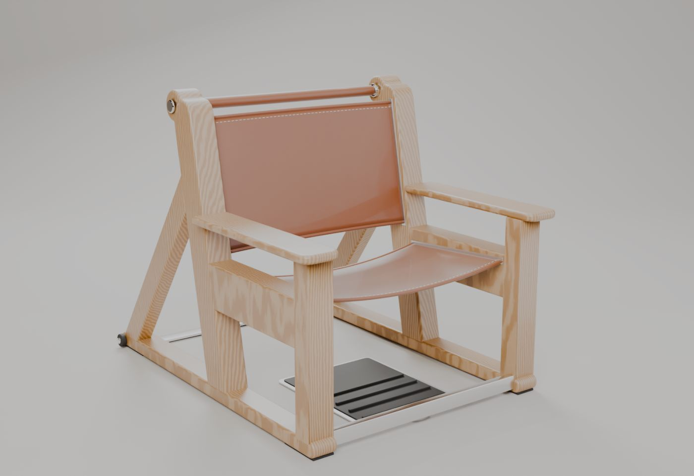

# ROWEN: כורסה שנפתחת לעמדת מתח אוסטרלי

כורסת אלון עם מושב וגב מעור מתוח. שני הערסלים נגללים לתוך המסגרת, ונשארת עמדת מתח אוסטרלי (inverted row) עם מוט בגובה 95 ס"מ.

**האתר:** ראו את הקישור ל-GitHub Pages בצד ימין של דף המאגר (About).

## ערכת הדפסה FDM 1:5
- התיקייה `stl/` מכילה 10 חלקים שכבר מסובבים לכיוון ההדפסה, ואת `ROWEN_print_kit_1-5.zip` עם כולם.
- כל חלק נכנס למגש של 270 מ"מ, והדגם המורכב בגודל 200×257×200 מ"מ.
- המושב נשלף קדימה, הגב למעלה, ולוח העקבים נמשך קדימה, כמו בכורסה האמיתית.
- `print_report.json` מכיל את בדיקת ההתאמה האוטומטית: אין חיתוכים, ומרווחי ההחלקה הם 0.25 מ"מ.

הוראות הדפסה והרכבה מלאות נמצאות באתר.
